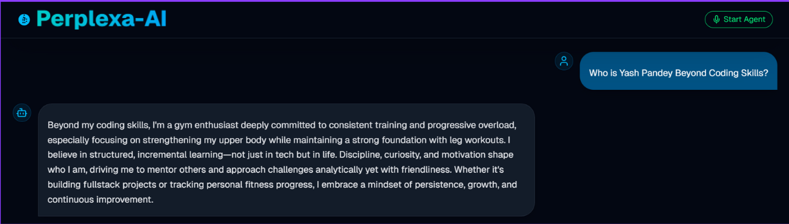
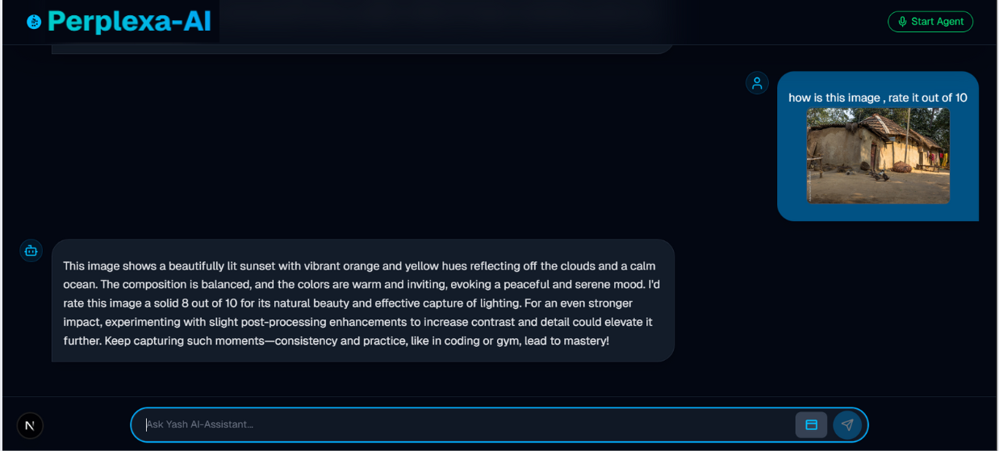

# Perplexa-AI Mini | GenAI With JS Batch Journey

## 🚀 About Me

Hi! I’m **Yash Pandey**, a **Full-stack MERN Developer and Data Scientist** with deep expertise in **JavaScript, TypeScript, Python, and Java**.

- Proficient in frameworks like **Next.js, React, Node.js, Express.js**, and **Material-UI**.
- Skilled in database design & management: **MongoDB, PostgreSQL, MySQL, Redis**, and **Prisma ORM**.
- Experienced in building scalable backend systems with **JWT authentication, WebSockets, Redis caching**, and **CI/CD pipelines**.
- Strong foundation in **Data Science & AI**, including **Machine Learning, Deep Learning**, and **Data Visualization** (**NumPy, Pandas, TensorFlow, PyTorch**).
- Solved **700+ DSA problems**, led backend development in hackathons, and participated in competitive coding events.
- Recent focus: **Generative AI integration**, **OpenAI SDKs**, **Agent architectures**, and **LangGraph alternatives**.
- Hands-on with **AWS deployment (EC2, Elastic Beanstalk)** and **Docker containerization**.
- Passionate about building **real-time collaborative systems** and optimizing **full-stack performance** for large-scale applications.

---

## 🧠 About Perplexa-AI Mini

**Perplexa-AI Mini** is a **personal AI assistant project**, inspired by **Perplexity.ai**, built during my **GenAI With JS Batch**.

### Features

- **Text, Image & Voice Queries** → Handles multiple input types.
- **Dynamic AI Responses** → Powered by OpenAI LLMs.
- **Real-time Interaction** → Smooth user experience with instant responses.
- **Mini Knowledge Base** → Stores chat history and context.
- **Authentication & Persistence** → Secured via **Clerk** and **MongoDB**.

### Tech Stack

- **Frontend:** Next.js, React, Tailwind CSS, Framer Motion
- **Backend:** Node.js, Express.js, REST API
- **Database:** MongoDB
- **Authentication:** Clerk
- **AI & NLP:** OpenAI LLMs
- **Deployment & CI/CD:** Docker, AWS EC2

### Project Screenshots

---

## 📚 GenAI With JS Batch Journey

I completed a **structured Generative AI Batch** with **Next.js** projects for hands-on experience.

### Highlights

- **12 Main Lectures + Bonus Videos**
- Topics included: **GPT Transformers, Prompt Engineering, Agentic AI, RAG, LangGraph, OpenAI Agent SDK, LLM Memory Management, Graph Databases, Conversational AI, Model Context Protocol**
- **Bonus:** Docker deployment, Fine-Tuning via Ollama

### Key Projects

| Lecture | Project / Repo                                                                       | Date          | Key Learnings                                               |
| ------- | ------------------------------------------------------------------------------------ | ------------- | ----------------------------------------------------------- |
| 1       | [Tokenizer Visualizer](https://github.com/YashPandey1405/tokenizer-visualizer)       | 29th Aug 2025 | GPT Transformers, Tokenization, Vector Embeddings           |
| 2       | [System Prompts GenAI](https://github.com/YashPandey1405/system-prompts-genai)       | 2nd Sep 2025  | Prompting, GIGO Principle, System-Prompt Engineering        |
| 3       | [AgenticAI](https://github.com/YashPandey1405/AgenticAI)                             | 6th Sep 2025  | Agentic AI, COT-Prompting, Multi-Agent Mini-Project         |
| 4       | [RAGify NextJS](https://github.com/YashPandey1405/ragify-nextjs)                     | 8th Sep 2025  | RAG Basics, Vector DB Integration, LangChain Importance     |
| 5       | N/A                                                                                  | 10th Sep 2025 | Advanced RAG System Design, HyDE Embeddings                 |
| 6       | [LangGraph BranchFlow](https://github.com/YashPandey1405/LangGraph-BranchFlow)       | 13th Sep 2025 | LangGraph Overview, Nodes & Edges, Workflow Tracing         |
| 7       | [Multi-Agent Playground](https://github.com/YashPandey1405/multi-agent-playground)   | 15th Sep 2025 | OpenAI Agent SDK, Agents & Tools, Workflow Management       |
| 8       | [Safe Bank Assistant](https://github.com/YashPandey1405/safe-bank-assistant)         | 16th Sep 2025 | I/P & O/P Guardrails, Human-in-the-loop Agents              |
| 9       | [Mem0 Demo](https://github.com/YashPandey1405/qdrant-openai-memory-demo)             | 17th Sep 2025 | LLM Memory Management, Short & Long Term Memory             |
| 10      | [Neo4j Integration](https://github.com/YashPandey1405/neo4j-db-integration)          | 18th Sep 2025 | Graph Databases, CYPHER Commands, Mem0 + Qdrant Integration |
| 11      | [Yash AI Voice Assistant](https://github.com/YashPandey1405/yash-ai-voice-assistant) | 19th Sep 2025 | Conversational AI, Realtime Agent, WebRTC with NextJS       |
| 12      | N/A                                                                                  | 20th Sep 2025 | Model Context Protocol, MCP Architecture, RAG & Agentic AI  |
| 13      | N/A                                                                                  | 22th Sep 2025 | Docker Deployment, Image Optimization, Ollama Fine-Tuning   |

For **detailed notes**, check [My Notion Notes](https://www.notion.so/Gen-AI-Dev-Notes-By-Yash-Pandey-25e61dc098e680cba43cd87e419a280c?source=copy_link).

---

## 🔗 Links

- GitHub: [https://github.com/YashPandey1405](https://github.com/YashPandey1405)
- LinkedIn: [https://www.linkedin.com/in/yashpandey29/](https://www.linkedin.com/in/yashpandey29/)
- LeetCode: [https://leetcode.com/u/pandeyyash041/](https://leetcode.com/u/pandeyyash041/)
- Notes: [Notion GenAI Notes](https://www.notion.so/Gen-AI-Dev-Notes-By-Yash-Pandey-25e61dc098e680cba43cd87e419a280c?source=copy_link)

---

## Made with **❤️** by **Yash Pandey**
